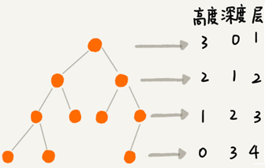
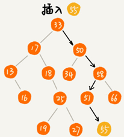
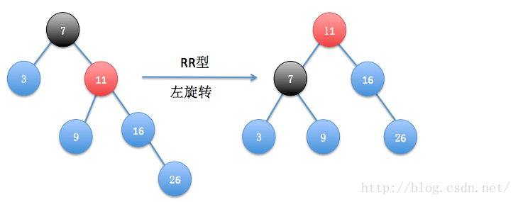

# 树（Tree）

## 二叉树（Binary Tree）

### 1.1 基础知识

[文章基础来源](https://github.com/xiao-xiaoming/DataStructure-BeautyOfAlgorithm/blob/master/docs/13.%E4%BA%8C%E5%8F%89%E6%A0%91%E5%9F%BA%E7%A1%80.md)

树是一种非线性表结构，比线性表的数据结构要复杂得多：

| 树的种类               |
| ---------------------- |
| 树，二叉树             |
| 二叉查找树             |
| 平衡二叉查找树、红黑树 |
| 递归树                 |

“树”的特征：


“树”这种数据结构里面每个元素叫作“节点”；用来连线相邻节点之间的关系叫作“父子关系”。

比如下面这幅图，A 节点就是 B 节点的**父节点**，B 节点是 A 节点的**子节点**。B、C、D 这三个节点的父节点是同一个节点，所以它们之间互称为**兄弟节点**。没有父节点的节点叫**根节点**，也就是图中的节点 E。没有子节点的节点叫作**叶子节点**或者**叶节点**，比如图中的 G、H、I、J、K、L 都是叶子节点。


**高度**（Height）、**深度**（Depth）、**层**（Level）的定义：

```
节点的高度=节点到叶子节点的最长路径(边数)
节点的深度=根节点到这个节点所经历的边的个数
节点的层数=节点的深度+1
树的高度=根节点的高度
```



“高度”是从下往上度量，从最底层开始计数计数的起点是 0。

“深度”是从上往下度量，从根结点开始度量计数起点也是 0。

“层数”跟深度的计算类似，不过计数起点是 1。


二叉树的每个节点最多有两个子节点，分别是左子节点和右子节点。二叉树中，有两种比较特殊的树，分别是满二叉树和完全二叉树。满二叉树又是完全二叉树的一种特殊情况。

二叉树既可以用链式存储，也可以用数组顺序存储。数组顺序存储的方式比较适合完全二叉树，其他类型的二叉树用数组存储会比较浪费存储空间。除此之外，二叉树里非常重要的操作就是前、中、后序遍历操作，遍历的时间复杂度是 O(n)，需要用递归代码来实现。

二叉树是树的一种，特点是每个节点最多有两个子节点，分别是**左子节点**和**右子节点**。不过，二叉树有的节点只有左子节点，有的节点只有右子节点：


上图编号 2 的二叉树中，叶子节点全都在最底层，除了叶子节点之外，每个节点都有左右两个子节点，这种二叉树就叫作**满二叉树**。

编号 3 的二叉树中，叶子节点都在最底下两层，最后一层的叶子节点都靠左排列，并且除了最后一层，其他层的节点个数都要达到最大，这种二叉树叫作**完全二叉树**。

### 1.2 二叉树的存储

完全二叉树和非完全二叉树的区别：


最后一层的叶子节点靠左排列的才叫完全二叉树，如果靠右排列就不能叫完全二叉树了。

存储一棵二叉树有两种方法，一种是基于指针或者引用的二叉链式存储法，一种是基于数组的顺序存储法。

**链式存储法**中每个节点有三个字段，其中一个存储数据，另外两个是指向左右子节点的指针。从根节点开始可以通过左右子节点的指针，把整棵树都串起来。这种存储方式我们比较常用。大部分二叉树代码都是通过这种结构来实现的。


``` python
class Node:
  def __init__(self, value, left, right):
    self.value = value
    self.left = left
    self.right = right
    
# example
node1 = Node(0)
node1_left = Node(1)
node1_right = Node(2)
node1.left = node1_left
node1.right = node1_right
```


基于数组的**顺序存储法**：把根节点存储在下标 i = 1 的位置，那左子节点存储在下标 2 * i = 2 的位置，右子节点存储在 2 * i + 1 = 3 的位置。以此类推，B 节点的左子节点存储在 2 * i = 2 * 2 = 4 的位置，右子节点存储在 2 * i + 1 = 2 * 2 + 1 = 5 的位置。


``` python
tree = [None,0,1,2,3,4,5,6]
# 0-->left(1)/right(2)
# 1-->left(3)/right(4)
# 2-->left(5)/right(6)
left_0 = tree[2*1] = 1
left_0 = tree[2*1+1] = 2
left_1 = tree[2*2] = 3
left_1 = tree[2*1+1] = 4
left_2 = tree[2*3] = 5
left_2 = tree[2*3+1] = 6
......
```

如果节点 X 存储在数组中下标为 i 的位置，左子节点的下标为 2 * i ，右子节点的下标为 2 * i + 1。反过来，下标为 i/2 的位置存储就是它的父节点。通过这种方式，只要知道根节点存储的位置（一般情况下，为了方便计算子节点，根节点会存储在下标为 1 的位置），就可以通过下标计算，把整棵树都串起来。

一棵完全二叉树仅仅“浪费”了一个下标为 0 的存储位置。如果是非完全二叉树，会浪费比较多的数组存储空间：


如果某棵二叉树是一棵完全二叉树，用数组存储无疑是最节省内存的一种方式。因为数组的存储方式并不需要存储额外的左右子节点的指针。

堆其实就是一种完全二叉树，最常用的存储方式是数组。

### 1.3 二叉树的遍历

将二叉树所有节点都遍历打印出来有三种方法，**前序遍历**、**中序遍历**和**后序遍历**。其中，前、中、后序，表示的是节点与它的左右子树节点遍历打印的先后顺序。

- 前序遍历是指，对于树中的任意节点来说，先打印这个节点，然后再打印它的左子树，最后打印它的右子树。
- 中序遍历是指，对于树中的任意节点来说，先打印它的左子树，然后再打印它本身，最后打印它的右子树。
- 后序遍历是指，对于树中的任意节点来说，先打印它的左子树，然后再打印它的右子树，最后打印这个节点本身。
- 总结：


**实际上，二叉树的前、中、后序遍历就是一个递归的过程**。比如，前序遍历，其实就是先打印根节点，然后再递归地打印左子树，最后递归地打印右子树。

写递推公式的关键就是，如果要解决问题 A，就假设子问题 B、C 已经解决，然后再来看如何利用 B、C 来解决 A。前、中、后序遍历的递推公式：

``` python
def pre_order(root):
    if root is not None:
        yield root.value
        yield from pre_order(root.left)
        yield from pre_order(root.right)

def in_order(root):
    if root is not None:
        yield from in_order(root.left)
        yield root.value
        yield from in_order(root.right)

def post_order(root):
    if root is not None:
        yield from post_order(root.left)
        yield from post_order(root.right)
        yield root.value
```


### 1.4 二叉查找树

[参考代码](https://www.cnblogs.com/lliuye/p/9118591.html)

二叉查找树是二叉树中最常用的一种类型，也叫二叉搜索树（Binary Search Tree）/二叉排序树（Binary Sort Tree）。二叉查找树支持动态数据集合的快速插入、删除、查找操作。

二叉查找树要求，在树中的任意一个节点，其左子树中的每个节点的值都小于这个节点的值，而右子树每个节点的值都大于这个节点的值:
$$
left_{node}<root_{node} \ \ \ and \ \ \ right_{node}>root_{node}
$$


#### 1.4.1 二叉查找树的查找操作

先取根节点，如果它等于要查找的数据就返回。如果要查找的数据比根节点的值小，那就在左子树中递归查找；如果要查找的数据比根节点的值大，那就在右子树中递归查找。


```python
# binary sort tree
# query node
def query(root, value):
    if root is None:
        return False
    if root.value == value:
        return True
    elif value < root.value:
        return query(root.left)
    else:
        return query(root.right)
```

#### 1.4.2 二叉查找树的插入操作

二叉查找树的插入过程需要从根节点开始，依次比较要插入的数据和节点的大小关系。

如果要插入的数据比节点的数据大，并且节点的右子树为空，就将新数据直接插到右子节点的位置；如果不为空，就再递归遍历右子树，查找插入位置。同理，如果要插入的数据比节点数值小，并且节点的左子树为空，就将新数据插入到左子节点的位置；如果不为空，就再递归遍历左子树，查找插入位置。



```
# binary sort tree
# insert node
def sort_tree_insert(root, value):
    if root is None:
        root = Node(value)
    elif root.value>value:
        root.left = sort_tree_insert(root.left, value)
    else:
        root.right = sort_tree_insert(root.right, value)
    return root
```

#### 1.4.3 二叉查找树的删除操作

针对要删除节点的子节点个数的不同需要分2种情况来处理。

如果要删除的节点只有一个子节点（只有左子节点或者右子节点）或没有子节点（左右子节点均为Null），只需要要将要删除节点的父节点的指针指向要删除节点的子节点。比如下图中删除节点 55、 13。

如果要删除的节点有两个子节点。需要找到这个节点的右子树中的最小节点，把它替换到要删除的节点上。然后再按照上面方法删除掉这个最小节点。比如下图中的删除节点 18。（用左子树的最大节点进行替换也可以）


```
# binary sort tree
# delete node
def del_node(root, value):
    if root is None:
        root = None
    elif root.value < value:
        root.right = del_node(root.right, value)
    elif root.value > value:
        root.left = del_node(root.left, value)
    else:
        if root.left is None and root.right is None:
            root = None
        elif root.left and root.right:
            tmp = query_minmax(root.right, max=False)
            root.value = tmp.value
            value = root.value
            root.right = del_node(root.right, value)
        elif root.left is None:
            root = root.right
        else:
            root = root.left
    return root
```

关于二叉查找树的删除操作，最简单的方法是单纯将要删除的节点标记为“已删除”并不真正从树中将这个节点去掉。这样原本删除的节点还需要存储在内存中，缺点是比较浪费内存空间。

#### 1.4.4 二叉查找树的其他操作

二叉查找树中还可以支持**快速地查找最大节点和最小节点、前驱节点和后继节点**。

二叉查找树也叫作二叉排序树，**中序遍历二叉查找树，可以输出有序的数据序列，时间复杂度是 O(n)**。

python代码实现：

```
    def find_min(self) -> Optional[TreeNode]:
        if self.tree is None: return None
        p = self.tree
        while p.left:
            p = p.left
        return p

    def find_max(self) -> Optional[TreeNode]:
        if self.tree is None: return None
        p = self.tree
        while p.right:
            p = p.right
        return p

    def _in_order(self, root: Optional[TreeNode]):
        if root:
            yield from self._in_order(root.left)
            yield root.data
            yield from self._in_order(root.right)

    def in_order(self) -> list:
        if self.tree is None:
            return []
        return list(self._in_order(self.tree))
```

### 1.5 AVL平衡二叉树

#### 1.5.1 插入节点

- 满足二叉搜索树的所有特性
- 左右子数的高度差（绝对值）小于等于1

**注意：** 关于下面所说的<u>非平衡点</u>是指距离新添加节点的最近点！如下图所示，有两个不平衡节点，但满足条件的是黄色节点。


最核心的操作只有一个：如何让插入/删除的节点符合AVL树的第二个特性？

看网上基本都将插入节点分成LL、LR、RR、RL四种类似，对应着不同的旋转。。。。看着非常的头晕眼花。

其实看下面一组图像就可以发现一点小规律（[图片来自](https://blog.csdn.net/u014634338/article/details/42465089)），不用看如何旋转，黑色是失衡节点，红色为最高子节点，仅仅找到失衡节点和控制点：

失衡节点：就是上面说的非平衡点（定义在上面）

控制节点（个人定义）：需要核心操作的节点（最中心的一个值）

最高子节点（个人定义）：失衡节点的最高子节点

--------

下图中16为失衡节点，11为控制节点（[9，11，16]），11为最高子节点。失衡节点和最高子节点重合。

- 最高子节点 < 非均衡节点 ==> L型
- 插入节点 < 最大子节点 ==> L型
- 合并起来就是LL型


下图中16为失衡节点，15为控制节点（[14，15，16]），14为最高子节点

- 最高子节点 < 非均衡节点 ==> L型
- 插入节点 > 最大子节点 ==> R型
- 合并起来就是LR型

> 当最大子节点不等于控制节点，需要将控制节点移动到最大子节点上。
>
> 因为需要保持和LL型一致，方便后面操作


上图中7为失衡节点，11为控制节点（[3，7，9，11，16，26]），11为最高子节点

- 最高子节点 > 非均衡节点 ==> R型
- 插入节点 > 最大子节点 ==> R型
- 合并起来就是RR型



上图中16为失衡节点，18为控制节点（[16，18，26]），26为最高子节点

- 最高子节点 > 非均衡节点 ==> R型
- 插入节点 < 最大子节点 ==> L型
- 合并起来就是RL型

> 当最大子节点不等于控制节点，需要将控制节点移动到最大子节点上。
>
> 因为需要保持和LL型一致，方便后面操作


#### 1.5.2 删除节点

直接看代码即可理解，和insert类似，迭代替换-->平衡-->替换-->平衡


### 1.6 红黑树


## 多叉树

